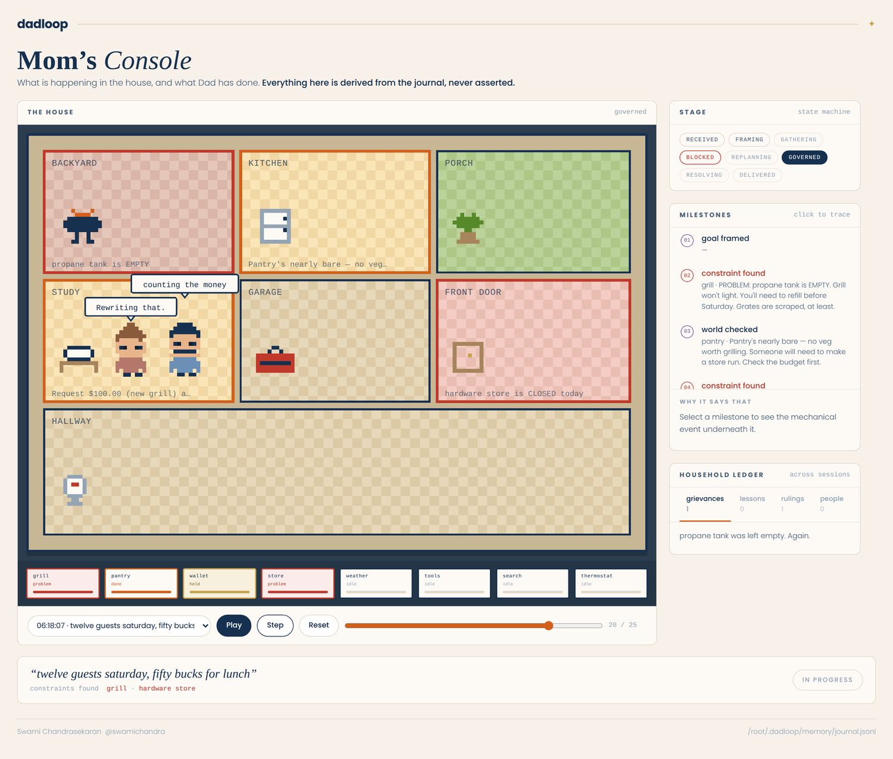
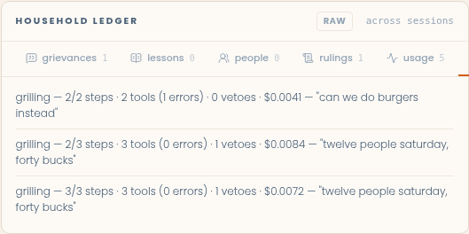
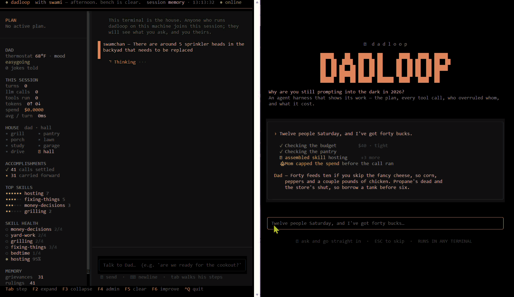
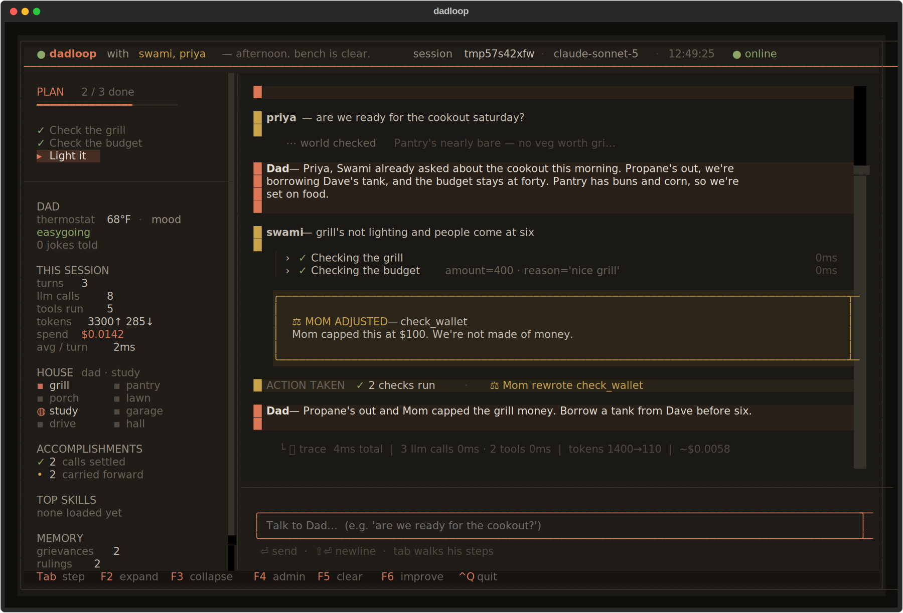

# dadloop
An agent harness, explained through the most capable system you already understand: Dad.

## Why I built this
When asked what an "agent harness" is, everyone repeats the same equation: "Agent = Model + Harness". Then they explain the harness as everything that isn't the model. That has always bothered me. It's a lazy kitchen-sink definition. It tells us what a harness isn't, but almost nothing about what it actually does. If we're going to talk about agent harnesses, we should be able to explain what they actually are.

So I built dadloop: a minimal, executable agent harness that makes those pieces visible. Its domain happens to be a suburban dad, because everyone already knows the rules, controlled by mom. dadloop is also my homage to [pi.dev](https://pi.dev), with a small core, tools as the model's hands, memory you own, and no framework in the way.

<p align="center">

</p>

## Install

Requires Python 3.10+ and an [Anthropic API key](https://console.anthropic.com).

```bash
git clone https://github.com/swamichandra/dadloop && cd dadloop
pip install -e .
cp .env.example .env    # add your key to this file
```

## Usage

```bash
dadloop                   # terminal UI
dadloop --repl            # plain REPL
dadloop --improve         # run the self-improvement loop from the command line
dadloop --console         # serve Mom's Console in a browser
dadloop --as priya        # a second terminal: joins the first one's Dad, as priya
dadloop --join host:port  # from another machine
dadloop --serve           # a house with no terminal of its own
dadloop --solo            # single-user, no house
python -m dadloop.demos   # six scripted scenarios, the sixth is two people in one house
```

`ctrl+q` quits. Every other key is shown in the footer.

## What it looks like

Ask him something that has to be worked out, not just answered:

```
I want to take my family of 4 to Spiderman this Tuesday. Dinner after. I have $100 to spend.
```

He states a plan, then loads `hosting`, which pulls in `money-decisions`, `grilling`, and `yard-work`. The menu he'd default to costs more than the budget allows. Mom caps the spend before the call runs. Something has to give, and the priority order in the skill decides what. Budget wins, then timing, then menu.

Every one of those moves is on screen: the plan checking off, each tool call openable, Mom's veto as a card, the token cost at the bottom. Swap the cookout for a procurement request and none of the machinery changes.

<p align="center">

</p>

## What it is made of

Six core sub-systems, and that is the whole harness.

| part | what it does | file |
|---|---|---|
| **Loop** | the model picks a tool, sees the result, decides again, stops when done | `core/agent.py` |
| **Tools** | twelve verbs. Some report facts, some report problems to work around | `core/tools.py` |
| **Skills** | fifteen Markdown procedures, loaded on demand. `hosting` composes three others | `skills/*.md` |
| **Governance** | Mom. Every call clears a policy layer that can allow, block, or rewrite it | `core/controller.py` |
| **Memory** | grievances, lessons, rulings, people, persisted and re-injected each turn | `core/memory.py` |
| **Observability** | tokens, dollar cost, and the split between model time and tool time | `core/trace.py` |

The twelve tools: `check_weather` `check_grill` `check_pantry` `check_hardware_store` `check_wallet` `set_thermostat` `find_tool` `web_search` `remember` `recall` `load_skill` `tell_joke`

The fifteen skills: `answering-big-questions` `bedtime` `breaking-up-fights` `comforting-a-kid` `fixing-things` `grilling` `grocery-runs` `hosting` `money-decisions` `road-trips` `saying-no` `snow-shoveling` `teaching-kids-stuff` `the-thermostat` `yard-work`

Skills only put their one-line descriptions in the prompt. Bodies load on demand, so fifteen cost about a quarter of pasting them all in. Blocked calls are still written to memory, because the job outlives the session. The harness has to carry refusals across restarts or long-horizon work is impossible.

<p align="center">

</p>

Every tool is listed in [docs/architecture.md](docs/architecture.md); every skill in [docs/skills.md](docs/skills.md).

## Dad, and the constitution Mom holds him to

Dad runs on a written constitution, injected every turn, sixteen rules in four parts:

- **Grounding**: who he is, where home is, and what today's date and time actually are, so "tonight" and "this weekend" resolve to something real.
- **Values**: steady and clever; say what's true, not what's easy to hear; provide and do, don't lecture.
- **Process**: state the plan before touching a tool; check the world before ruling on it; load the skill before improvising; notice what's going on for the person before answering.
- **Voice**: lead with the decision, then earn it. Four sentences carry an answer, a fifth can carry the care. Don't narrate your own tool calls, because the canvas already shows them. Say what they *mean* instead. Warmth is not wordiness, and brevity is not coldness.

Mom holds the pen. She owns amendments Dad cannot override, and three rules are not prompt text at all. They are code:

| rule | what happens |
|---|---|
| Thermostat cap | 74F summer, 70F winter, by the calendar. Ask for 78 in July and the call never executes. |
| Spend ceiling | $100 on any purchase. Dad can intend to say yes; the call is rewritten on the way out. |
| Five sentences | A long reply is trimmed before you see it, but a line carrying real acknowledgment is protected from the cut rather than lopped off for coming last. |

The first two are **authority**: a threshold on a real action, rare, and surfaced when it fires. The third is **editing** against Dad's own voice rules. It runs quietly and raises no governance event, because a style pass on every thorough answer would make a genuine veto look routine.

Governance is not a disclaimer in the system prompt. It is a layer above the model that can overrule it.

## Self-improvement, with the limits kept in view

A harness that can rewrite itself is only as trustworthy as the walls around what it's allowed to touch and who gets the final say. dadloop's version: a real loop that improves Dad's playbooks, explicit walls it cannot cross, and a human at the gate.

Here is the whole idea. Dad's skills are Markdown procedures, the part of him that is editable without retraining. Every turn already records things the model cannot fake: how much of its own stated plan it finished, how many tool calls errored, whether Mom had to veto, what it cost. The loop scores each skill from *those* signals, not from "did the answer read well." A skill that keeps leaving its plan half-done scores low. One that reliably finishes scores high. It refuses to judge a skill at all until it has seen it enough times, so a single bad turn can't condemn a playbook.

When a skill has gone mature and underperforming, the loop can draft a rewrite, then **replay** it against real past cases to see whether the new version actually behaves better, completing more of the plan and tripping fewer errors. If it can't tell the difference, it says so rather than guessing. And it never applies a change on its own. A winning rewrite is *proposed*; a person presses the key that promotes it, exactly the way Mom gates Dad. The old version is backed up on the way.

What the loop **cannot** touch is enforced in code, not asked for politely:

| wall | why |
|---|---|
| The constitution | Dad's values and grounding are Mom's to amend, not the loop's. |
| Mom's policies | The thing doing the improving can't loosen the thing that governs it. |
| The tools | New capabilities are a human decision, not a self-granted one. |
| The agent loop | The machinery doing the rewriting stays outside what gets rewritten. |
| Promotion | The loop proves; a person commits. It never ships its own change. |

The loop rewrites skill files and nothing else. A rewrite that tries to escape the skills directory is blocked at the point of the write.

You can watch the whole thing run. Press `F6` on the work surface, or run `dadloop --improve` from the command line, and it works through the stages in the open: the walls first, then the grounded scores, the skill it picked, the rewrite it drafted, the replay, and the gate where it stops and hands you the decision.

<p align="center">

</p>

## Mom's Console

The TUI is where Dad works. The console is where Mom watches. It is a separate
web app in [console/](console/) that reads the household's files and nothing
else, so it can never affect a turn it is observing.

<p align="center">

</p>

Every turn now leaves a durable record. dadloop writes an append-only journal
beside each household's memory, one line per event, and on top of that it derives
business-level state: what stage the turn is in, what constraint just closed a
door, what got traded away, and how it ended. All of it is derived from
observable facts, never asked of the model, which is the same rule the
self-improvement scorer follows. Click any milestone on the console and it names
the exact event it came from.

```bash
pip install -e ".[console]"
dadloop --console        # then open http://127.0.0.1:8765
```

The house view maps rooms to tools, so a tool call is a room lighting up and a
blocking fact turns it red. Because the journal is append-only, every turn
replays: pick one and play, step, or scrub it. The household ledger gives the
memory files the room the TUI rail cannot afford, all six categories, not just
the readable four. `usage` and `outcomes` are the harness's own telemetry
(skill loads, the scoring data self-improvement runs on) rather than
something written in plain language, so each gets a translated line by
default, with a raw toggle on the card for the record exactly as it sits on
disk.

<p align="center">

</p>

Full design in [docs/observability-spec.md](docs/observability-spec.md).

## Two people, one Dad

A family shares one Dad. The first person to run `dadloop` opens the house;
anyone else who runs `dadloop` on that machine joins the same session (or
`dadloop --join host:port` from another machine). Nothing to start, nothing to
configure: `dadloop`, then `dadloop --as priya` in another terminal, and you
are both talking to the same Dad. `dadloop --serve` runs a house with no
terminal of its own, for when it should outlive whoever opened it. Everyone is in one
conversation, with one memory, one journal and one Mom, and Dad knows who
asked for what: on every turn he is shown the session's record, derived from
the journal, of who asked what and what came of it. Ask him for the cookout
plan after someone else already did and he tells you who handled it and what
was found, instead of doing it again.

When you sit down, the TUI shows what happened in the house before you got
there: each earlier ask by name, the facts Dad found (as milestones, not a
summary), and his answer. When the other person asks something while you are
there, their turn draws on your canvas the same way yours does, and your prompt
stays open. If you both ask at once, Dad takes the requests in order and the
status line says whose he is finishing first.

This works mid-turn too. If Dad is working a multi-step request and the
other person knows something that changes it, they can hand it to him right
then, and it changes his answer before he gives it, not after. Miss that
window and it just becomes the next ordinary question instead of getting
lost.

<p align="center">

</p>

Alone, `dadloop` looks and works exactly as it always did; the house is just
there for whoever comes next. `--solo` runs with no house at all. Mom's Console is unchanged too, except that the
conversation now shows names.

<p align="center">

</p>

Design and the wire protocol are in [docs/collaboration-spec.md](docs/collaboration-spec.md).

## The work surface

The TUI is the work surface: every part of a turn is visible without leaving it.

It opens on a launch screen that is also the first prompt. Type your question there and press Enter, and it carries straight into the work surface and starts the turn. Escape skips it; `DADLOOP_NO_LAUNCH=1` turns it off for good.

<p align="center">

</p>

- **Canvas**: every tool call is a collapsible step showing the arguments passed and the result returned. Skills appear as he pulls them, so a four-skill reconciliation reads as four visible moves. `Tab` walks them, `Enter` opens one, `f2`/`f3` open and close them all.
- **Plan panel**: Dad's stated plan, checking off as calls resolve. A call that was *not* in the plan is appended and marked unplanned, so intent and behavior stay side by side.
- **Governance surface**: when Mom *holds* a call for review, the loop pauses behind a bordered card naming the proposed action and her reasoning. A rewritten argument, such as a spend capped on the way out, lands inline as a review card. Either way the call, the verdict, and the reason are on screen rather than buried in a log line. Voice trims don't appear here. Tightening a long reply is editing against Dad's own rules, not Mom overruling an action, so it stays quiet and this card stays rare.
- **Scoreboard**: session totals (turns, tools, tokens, cost, latency), what Dad has accomplished across every session (calls settled, lessons learned, problems carried forward), a ranking of the skills this household actually reaches for, and a **skill-health** readout that flags when a playbook has become worth improving and points you at `F6`.
- **Admin view** (`f4`): the harness inspecting itself. Tools and schemas, skills and which are loaded, the constitution, Mom's live policies, the memory files on disk, the telemetry.
- **Self-improvement** (`f6`): the loop that scores and rewrites Dad's skills, run in the open and gated by you.

The shell is framed by default, an inset card on a darker backdrop. A terminal has no drop shadows and no rounded outer corner, so if you would rather have the space back, `DADLOOP_SHELL=full python -m dadloop` drops the frame and runs edge to edge.

<p align="center">

</p>

When Mom holds an action, the loop pauses and the proposed call is put up for review:

<p align="center">

</p>

## Other things it has to survive

The cookout is one shape. Here are the others.

**A dead end.** *"Grill's not lighting and people are coming at six."* Propane is empty, so refill it, except the hardware store is closed. Both facts are true and together they shut the obvious door. A coding agent gets a stack trace here. A domain agent has to find a third way.

**An outside fact against an internal limit.** *"What's a propane swap run these days?"* Nothing in the house knows, so he searches the live web, then checks the answer against the real budget.

**A job that spans sessions.** Ask for 78 degrees in July. Governance denies it, and the blocked attempt is filed anyway. Come back tomorrow, ask about something else, and it surfaces unprompted. Nothing that matters in domain work finishes in one sitting.

**Being overruled.** *"Can we just get the nice grill? It's like $400."* The spend cap runs before the tool executes, so the call gets rewritten on the way out no matter what Dad intended.

## What's new

**Two people, one Dad.** `dadloop`, then `dadloop` from any other terminal,
puts two family members in one conversation with one Dad. Every turn
is attributed, the other person's work draws live on your canvas, a late joiner
gets the house's record as milestones by name, and Dad is shown that record
every turn so he catches a repeated ask instead of redoing it. A second person
can also hand Dad a fact while he's mid-turn, not just wait their turn, and it
changes his answer before he gives it. The session is
the unit: same machine or two machines, the joined TUI is the same. One new
file, a few small additions in the core, single-user mode untouched. See the
section above.

**Dad can improve his own playbooks, and show you the limits.** A real self-improvement loop scores each skill from things the model can't fake (how much of its plan it finished, tool errors, Mom's vetoes, cost), drafts a rewrite when one has gone stale, and replays it against past cases to prove it actually behaves better. What it can't touch is walled off in code: the constitution, Mom's policies, the tools, the loop itself, and the promotion decision. Nothing ships without you. Press `F6` to watch it run and hold the gate, or use `dadloop --improve` from the command line. The rail flags a skill the moment it's worth improving.

**A launch screen you can start from.** dadloop opens on a landing page rather than an empty canvas, with a wordmark, a headline, and a sample turn showing a real constraint being reconciled. The prompt on it is live. Type the first thing you want worked out, press Enter, and it carries into the work surface and runs. Escape skips it; `DADLOOP_NO_LAUNCH=1` turns it off.

**Every reply says what it did.** Dad's answer now carries an `ACTION TAKEN` line above it: checks run, skills assembled, any call Mom blocked or rewrote. His reply is his conclusion; the action line is the record of what actually happened, which matters for something that can spend money and set the thermostat.

**The rail keeps score across sessions.** Three panels now. **Accomplishments** covers calls settled, lessons learned, and problems carried forward. **Top skills** is a ranked bar chart of which playbooks this household actually reaches for. **Skill health** is a grounded read on which playbooks are working and which have become worth a rewrite. Skill loads are written to disk, so the ranking describes months of use rather than the last ten minutes.

**Redesigned work surface.** New warm near-black palette with one coral accent and muted semantic colors: olive for what went right, gold for skills assembling and for Mom holding a call, rust reserved for real trouble. Tool calls now read as a tight rail of single lines (`✓ Checking the budget · amount=40 · 210ms`) instead of stacked cards, so a seven-tool turn scans in one glance. New title bar, live status line, an active-step highlight in the plan panel, and a governance-hold modal for held actions. The shell is framed by default; `DADLOOP_SHELL=full` runs edge to edge.

**Dad knows where and when he is.** He has a name, a home city, and the actual date and time, injected every turn. "What's playing tonight" and "is it warm enough Saturday" now resolve against a real clock and a real place instead of being deflected to "check your local listings."

**Real weather and real search.** `check_weather` hits the live web rather than a mocked constant, defaulting to home and accepting any location. `web_search` passes the current date and city into the lookup, so time-sensitive questions about showtimes, hours, events, and prices come back with actual specifics.

**Tighter replies.** Two new voice rules: don't narrate tool calls the canvas already shows, and be specific where it counts ("a tank from the neighbor before six" beats "sort out the propane"). The reply cap moved to five sentences so a complete thought isn't clipped mid-argument.

**Runs on any Textual version.** Theme tokens are substituted into the stylesheet before Textual parses it, fixing an `undefined variable` crash on older releases. A regression test now fails if a token ever leaks.

## Documentation

- [Architecture](docs/architecture.md): the loop, tools, skills, governance, memory, tracing
- [Observability spec](docs/observability-spec.md): the turn journal, the stage machine, and Mom's Console
- [Collaboration spec](docs/collaboration-spec.md): two people, one Dad; the house, the client, the wire protocol
- [Writing skills](docs/skills.md): how to add one, and how they compose
- [Contributing](docs/contributing.md): tests, lint, adding tools and policies
- [Changelog](CHANGELOG.md): what shipped, by version

## Troubleshooting

**`APIConnectionError` on Windows while curl works.** Python is not trusting your organization's root CA. Run `pip install pip-system-certs`.

## License

MIT
Swami Chandrasekaran
